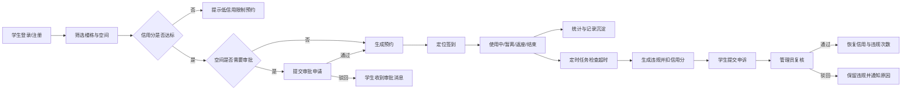

# EchoStudy 校园学习空间运营与信用治理平台

EchoStudy 是一个前后端分离的校园学习空间运营平台，面向学生和管理员两类用户，覆盖空间资源维护、在线预约、定位签到、暂离返座、审批、线下代预约、违规信用治理、申诉复核、报修运维、公告通知、规则配置和运营统计等流程。


> 本 README 面向课程项目提交和后续报告写作：让没有读过代码的人先理解系统定位、功能模块、关键接口、数据库脚本和验证方式。报告正文、截图和答辩稿可以在此基础上继续展开。

## 项目定位

传统“自习室预约”容易被理解为单一 CRUD。EchoStudy 的定位是校园学习空间的综合运营系统，核心不是只完成一次预约，而是把空间资源、预约履约、信用约束、异常处理和统计分析串成闭环。

- 学生端：找空间、约座位/工位、签到使用、暂离返座、提交报修、查看消息、查看信用和提交申诉。
- 管理端：维护空间和座位、审批特殊空间、线下代预约、处理报修、发布公告、配置规则、管理用户信用、查看统计。
- 后端：通过 REST API、JWT 鉴权、SQL Server 持久化、定时任务和系统配置项支撑业务流程。

## 三个主模块

| 主模块 | 面向角色 | 说明 | 主要代码证据 |
| --- | --- | --- | --- |
| 学习空间资源与排期管理 | 学生、管理员 | 楼栋、空间、座位/工位、空间类型、开放状态、时间节点、座位网格和资源冲突控制 | `StudentResourceController`, `AdminSpaceController`, `AdminRoomController`, `AdminSeatController`, `AdminTimeNodeController`, `ReservationServiceImpl` |
| 预约履约与信用治理 | 学生、管理员 | 在线预约、整间空间审批、签到、暂离、返座、结束、违规记录、信用扣分、低信用限制、违规申诉和管理员复核 | `StudentReservationController`, `AdminApprovalController`, `AdminReservationController`, `ViolationController`, `ViolationServiceImpl`, `ReservationMaintenanceTask` |
| 运维通知与数据分析 | 学生、管理员 | 报修工单、资源故障联动、公告、通知、配置变更、操作日志、学生学习统计和管理员运营统计 | `StudentRepairController`, `AdminRepairController`, `NotificationController`, `AdminAnnouncementController`, `AdminConfigController`, `AdminStatisticsController` |

## 功能模块

| 模块 | 使用角色 | 已实现功能 | 主要代码证据 |
| --- | --- | --- | --- |
| 认证与账号 | 学生、管理员 | 学生注册、管理员登录、管理员创建新管理员、用户名/手机号/学号登录、预留验证码式找回密码 | `AuthController`, `AuthServiceImpl`, `JwtInterceptor` |
| 空间资源 | 学生、管理员 | 楼栋筛选、空间列表、空间详情、空间类型、开放/关闭、座位/工位维护、批量生成座位 | `StudentResourceController`, `AdminSpaceController`, `AdminRoomController`, `AdminSeatController` |
| 在线预约 | 学生 | 按日期、空间、时间段查看座位网格，创建线上预约，查看个人预约 | `StudentReservationController`, `ReservationServiceImpl` |
| 预约生命周期 | 学生、管理员 | 取消、定位签到、暂离、返座、结束；管理员可取消或结束预约 | `ReservationServiceImpl`, `LocationUtils` |
| 审批与线下代预约 | 管理员 | 审批需要审核的空间预约，为学生创建线下预约，校验资源和用户时间冲突 | `AdminApprovalController`, `AdminReservationController` |
| 信用与违规申诉 | 学生、管理员 | 违规自动扣信用分、低信用限制预约、学生提交申诉、管理员通过/驳回、申诉通过恢复信用和违规次数 | `ViolationController`, `ViolationServiceImpl`, `AdminUserController`, `frontend/src/views/StudentViolations.vue`, `frontend/src/views/AdminViolations.vue` |
| 规则评分式自动预约 | 学生、管理员 | 学生提交偏好任务；系统按偏好空间、插座、靠窗等规则为可用座位打分并尝试预约 | `AiReservationController`, `AiReservationServiceImpl.score` |
| 报修管理 | 学生、管理员 | 学生提交空间/座位报修，管理员受理、处理中、驳回、完成，并可联动座位故障或空间开放状态 | `StudentRepairController`, `AdminRepairController`, `RepairServiceImpl` |
| 公告与消息 | 学生、管理员 | 管理员发布、置顶、停用公告；学生查看公告和系统消息，支持已读/全部已读 | `AdminAnnouncementController`, `StudentAnnouncementController`, `NotificationController` |
| 系统配置与日志 | 管理员 | 维护签到、暂离、封禁、信用扣分、低信用限制、审批、报修、自动预约等规则，记录配置变更和关键操作 | `AdminConfigController`, `AdminOperationLogController`, `ConfigServiceImpl`, `frontend/src/views/AdminConfigs.vue` |
| 统计分析 | 学生、管理员 | 学生学习统计；管理员查看空间、报修、审批、学习排行等运营统计 | `StudentStatisticsController`, `AdminStatisticsController`, `AdminDashboardController` |

## 关键业务流程



## 技术栈

| 层 | 技术 |
| --- | --- |
| 后端 | Java 17, Spring Boot 3.3.5, Spring MVC, MyBatis Plus 3.5.9, JWT, Spring Task, Lombok, Knife4j 4.5.0, Maven |
| 前端 | Vue 3, Vite 5, Vue Router, Element Plus, Axios |
| 数据库 | SQL Server |
| 接口文档 | Knife4j / OpenAPI，后端启动后访问 `http://localhost:8080/doc.html` |

## 系统结构

```text
EchoStudy/
├─ backend/                         # Spring Boot 后端
│  ├─ pom.xml                       # Maven 依赖和 Java 版本
│  └─ src/main/
│     ├─ java/com/echostudy/
│     │  ├─ controller/             # REST API 控制器
│     │  ├─ service/impl/           # 核心业务实现
│     │  ├─ mapper/                 # MyBatis Plus Mapper
│     │  ├─ entity/                 # 数据表实体
│     │  ├─ dto/                    # 请求对象
│     │  ├─ vo/                     # 响应对象
│     │  ├─ security/               # JWT、拦截器、用户上下文
│     │  ├─ task/                   # 定时维护任务
│     │  └─ config/                 # Web、预约规则和初始化配置
│     └─ resources/
│        ├─ application.yml         # 本地环境配置，按本机数据库修改
│        └─ db/                     # SQL Server 建表、升级和种子数据脚本
├─ frontend/                        # Vue 3 + Vite 前端
│  ├─ package.json                  # npm 脚本和前端依赖
│  └─ src/
│     ├─ views/                     # 登录、学生端、管理端页面
│     ├─ components/                # 布局、卡片、状态标签等组件
│     ├─ config/                    # 页面标题、菜单、状态映射
│     └─ styles/                    # 主题、布局和组件样式
└─ docs/                            # 运行说明、API 摘要、阶段记录和文档审核材料
```

## 关键接口

后端接口统一返回：

```json
{ "code": 200, "message": "success", "data": {} }
```

除登录、学生注册、找回密码验证码和重置密码外，业务接口需要携带：

```text
Authorization: Bearer <token>
```

### 认证接口

| 方法 | 路径 | 用途 |
| --- | --- | --- |
| POST | `/api/auth/register` | 学生注册 |
| POST | `/api/auth/admin/register` | 有权限的管理员创建新管理员 |
| POST | `/api/auth/login` | 学生或管理员登录 |
| POST | `/api/auth/forgot-password/code` | 预留验证码式找回密码，当前返回测试验证码说明 |
| POST | `/api/auth/forgot-password/reset` | 使用验证码重置密码 |
| GET | `/api/auth/me` | 获取当前登录用户和信用分 |

### 学生端关键接口

| 模块 | 方法与路径 | 用途 |
| --- | --- | --- |
| 空间资源 | `GET /api/student/buildings` | 获取可筛选楼栋 |
| 空间资源 | `GET /api/student/spaces?building=` | 查询空间列表 |
| 空间资源 | `GET /api/student/spaces/{id}` | 查看空间详情 |
| 时间节点 | `GET /api/student/time-nodes` | 获取可预约时间节点 |
| 座位网格 | `GET /api/student/seats/layout?roomId=&date=&startTime=&endTime=` | 查看指定时间段座位占用 |
| 在线预约 | `POST /api/student/reservations/online` | 创建线上预约，会校验资源冲突、时间节点、低信用限制 |
| 我的预约 | `GET /api/student/reservations/my` | 查看个人预约 |
| 预约操作 | `POST /api/student/reservations/{id}/cancel` | 取消预约 |
| 预约操作 | `POST /api/student/reservations/{id}/sign-in` | 定位签到 |
| 预约操作 | `POST /api/student/reservations/{id}/leave` | 暂离 |
| 预约操作 | `POST /api/student/reservations/{id}/return` | 返座 |
| 预约操作 | `POST /api/student/reservations/{id}/finish` | 结束预约 |
| 自动预约 | `POST /api/student/ai-tasks` | 创建规则评分式自动预约任务 |
| 自动预约 | `GET /api/student/ai-tasks/my` | 查看我的自动预约任务 |
| 报修 | `POST /api/student/repairs` | 提交报修 |
| 报修 | `GET /api/student/repairs/my` | 查看我的报修 |
| 消息 | `GET /api/student/announcements` | 查看公告 |
| 消息 | `GET /api/student/notifications` | 查看消息 |
| 统计 | `GET /api/student/statistics/learning` | 查看学习统计 |
| 违规信用 | `GET /api/student/violations/my` | 查看我的违规记录、信用扣分和申诉状态 |
| 违规申诉 | `POST /api/student/violations/{id}/appeal` | 对违规记录提交申诉 |
| 违规申诉 | `GET /api/student/violation-appeals/my` | 查看我的申诉记录 |

### 管理端关键接口

| 模块 | 方法与路径 | 用途 |
| --- | --- | --- |
| 首页 | `GET /api/admin/dashboard` | 后台概览数据 |
| 用户 | `GET /api/admin/users` | 用户列表，包含信用分和违规次数 |
| 用户 | `PUT /api/admin/users/{id}` | 更新用户资料 |
| 用户信用 | `PUT /api/admin/users/{id}/credit-score` | 管理员人工调整信用分并记录操作日志 |
| 用户状态 | `POST /api/admin/users/{id}/ban` / `unban` | 封禁或解封 |
| 用户状态 | `POST /api/admin/users/{id}/disable` / `enable` | 禁用或启用 |
| 空间 | `GET /api/admin/buildings` | 获取楼栋 |
| 空间 | `GET /api/admin/spaces` | 空间列表 |
| 空间 | `POST /api/admin/spaces` / `PUT /api/admin/spaces/{id}` | 新增或编辑空间 |
| 空间 | `POST /api/admin/spaces/{id}/open` / `close` | 开放或关闭空间 |
| 座位 | `GET /api/admin/seats?roomId=` | 座位列表 |
| 座位 | `POST /api/admin/seats/batch-generate` | 批量生成座位/工位 |
| 时间节点 | `GET /api/admin/time-nodes` | 时间节点列表 |
| 线下代预约 | `POST /api/admin/reservations/offline` | 管理员代学生预约 |
| 预约记录 | `GET /api/admin/reservations` | 查看预约记录 |
| 审批 | `GET /api/admin/approvals` | 待审批/审批记录 |
| 审批 | `POST /api/admin/approvals/{id}/approve` / `reject` | 通过或驳回预约 |
| 报修 | `GET /api/admin/repairs` | 报修列表 |
| 报修 | `POST /api/admin/repairs/{id}/accept` / `process` / `reject` / `finish` | 处理报修 |
| 公告 | `GET /api/admin/announcements` | 公告列表 |
| 公告 | `POST /api/admin/announcements` / `PUT /api/admin/announcements/{id}` | 新增或编辑公告 |
| 公告 | `POST /api/admin/announcements/{id}/publish` / `disable` / `pin` / `unpin` | 发布、停用、置顶、取消置顶 |
| 规则配置 | `GET /api/admin/configs` | 查看系统规则 |
| 规则配置 | `PUT /api/admin/configs/{key}` | 修改系统规则，包括信用阈值、扣分值、申诉开关 |
| 操作日志 | `GET /api/admin/operation-logs` | 查看管理员操作日志 |
| 统计分析 | `GET /api/admin/statistics/overview` | 运营统计概览 |
| 统计分析 | `GET /api/admin/statistics/spaces` / `repairs` / `approvals` / `learning-rank` | 空间、报修、审批和学习排行统计 |
| AI 任务 | `GET /api/admin/ai-tasks` | 查看自动预约任务 |
| 违规信用 | `GET /api/admin/violations` | 查看违规记录 |
| 违规申诉 | `GET /api/admin/violation-appeals?status=` | 按状态查看申诉 |
| 违规申诉 | `POST /api/admin/violation-appeals/{id}/approve` / `reject` | 通过或驳回申诉 |

## 核心设计与报告素材

这些内容适合后续写课程报告或答辩时展开。这里列出证据位置和可讲角度，不替代完整报告正文。

| 报告角度 | 可以怎么讲 | 代码证据 |
| --- | --- | --- |
| 前后端分离 | 前端通过 Vite 代理 `/api` 到后端，后端提供 REST API，登录后用 JWT 维护用户身份 | `frontend/vite.config.js`, `frontend/src/api.js`, `JwtInterceptor` |
| 角色隔离 | 学生接口以 `/api/student` 开头，管理员接口以 `/api/admin` 开头，拦截器按角色阻止越权访问 | `JwtInterceptor`, `frontend/src/router.js` |
| 预约冲突控制 | 同一用户或同一资源在有效状态下不能出现时间重叠；座位型空间和整间空间使用不同冲突判断 | `ReservationServiceImpl.createReservation`, `hasSeatConflict`, `hasRoomConflict` |
| 空间类型差异 | `STUDY_ROOM`、`PUBLIC_AREA`、`LAB_SEAT` 按座位/工位预约，`SEMINAR_ROOM`、`CLASSROOM` 按整间预约 | `ReservationServiceImpl`, `v2_seed_spaces.sql` |
| 定位签到 | 签到时计算用户位置与空间坐标距离，超出允许半径则拒绝签到 | `ReservationServiceImpl.signIn`, `LocationUtils` |
| 定时维护 | 每 60 秒处理首次签到超时、暂离返座超时、预约到期、封禁恢复和自动预约任务 | `ReservationMaintenanceTask` |
| 信用治理 | 违规生成时自动扣信用分，低信用学生被限制预约；申诉通过后恢复信用和违规次数 | `ViolationServiceImpl.markViolation`, `approveAppeal`, `ReservationServiceImpl.ensureCreditAllowsReservation` |
| 规则配置 | 签到时限、暂离时长、封禁阈值、信用扣分、低信用阈值、AI/审批/报修开关从系统配置读取 | `ConfigServiceImpl`, `AdminConfigs.vue`, `v2_upgrade.sql` |
| 规则评分式自动预约 | 对候选座位按偏好空间、插座、靠窗加分，选择得分最高且无冲突的座位创建预约 | `AiReservationServiceImpl.score`, `executeOne` |
| 报修联动资源状态 | 管理员处理报修时可标记座位故障/恢复，或关闭/重新开放空间 | `RepairServiceImpl.applyResourceLinkage` |
| 通知闭环 | 审批、报修、违规、申诉、封禁、自动预约结果会写入通知，学生端统一查看 | `NotificationController`, `ReservationServiceImpl`, `RepairServiceImpl`, `ViolationServiceImpl` |
| 用户视角错误提示 | 后端统一处理业务异常，前端过滤技术异常，页面展示行为原因而不是代码层面的报错 | `GlobalExceptionHandler`, `frontend/src/api.js` |

## 数据库与脚本

数据库类型为 SQL Server。脚本位于 `backend/src/main/resources/db/`。

| 脚本 | 作用 |
| --- | --- |
| `schema.sql` | 创建基础表、基础账号、基础自习室、座位和时间节点；已包含 `credit_score`、`credit_deduct_points` 和 `violation_appeal` |
| `v2_upgrade.sql` | 对旧库补充 V2 字段和表，例如审批、报修、公告、通知、配置、日志、暂离记录、信用分和违规申诉 |
| `v2_seed_spaces.sql` | 补充多类型空间、楼栋、座位/工位数据，并处理整间预约空间不维护座位的问题 |

> `application.yml` 是本地运行配置，需要按本机 SQL Server 修改。公开提交或部署时，不应把真实生产账号、密码或密钥写入仓库。

## 快速开始

### 环境要求

- JDK 17
- Maven
- Node.js 和 npm
- SQL Server

### 初始化数据库

1. 在 SQL Server 中创建数据库，例如 `echo_study`。
2. 按本机 SQL Server 账号修改 `backend/src/main/resources/application.yml`。
3. 按顺序执行：

```text
backend/src/main/resources/db/schema.sql
backend/src/main/resources/db/v2_upgrade.sql
backend/src/main/resources/db/v2_seed_spaces.sql
```

### 启动后端

```powershell
cd backend
mvn spring-boot:run
```

默认地址：

```text
http://localhost:8080
```

### 启动前端

```powershell
cd frontend
npm install
npm run dev
```

默认地址：

```text
http://localhost:5173
```

### 演示账号

| 角色 | 账号 | 密码 |
| --- | --- | --- |
| 管理员 | `admin` | `test123456` |
| 学生 | `student` | `test123456` |

如果数据库中已有旧数据，实际密码以数据库记录为准。

## 验证记录

当前仓库没有独立自动化测试用例目录。以下命令已在本地验证：

| 日期 | 命令 | 结果 |
| --- | --- | --- |
| 2026-07-03 | 在 `backend/` 执行 `mvn test` | 成功；Maven 显示没有测试源可运行 |
| 2026-07-03 | 在 `frontend/` 执行 `npm run build` | 成功；Vite 输出第三方注释提示和 chunk 体积提示，不影响产物生成 |

可复跑命令：

```powershell
cd backend
mvn test
```

```powershell
cd frontend
npm run build
```

## 建议演示流程

1. 学生登录，查看空间列表和座位网格。
2. 学生创建普通座位预约，展示冲突校验和时间节点限制。
3. 学生对需要审批的空间提交预约申请。
4. 管理员通过或驳回审批，学生端查看通知。
5. 学生签到、暂离、返座或结束预约。
6. 通过定时任务或构造数据展示违规生成、信用扣分和低信用限制预约。
7. 学生在“信用与违规”中提交申诉。
8. 管理员在“信用治理”中通过或驳回申诉，展示信用恢复、违规次数变化和通知。
9. 学生提交报修，管理员处理报修并联动座位故障状态。
10. 管理员修改信用阈值、扣分值、申诉开关等配置，展示系统规则可调整。

## 后期报告建议

写课程报告时，可以按下面结构展开：

1. **需求背景**：校园学习空间占用不透明、预约冲突、签到履约、信用约束、报修和运营统计痛点。
2. **系统角色与功能**：学生端、管理端分别负责什么，用“三个主模块”和“功能模块”表作为目录。
3. **系统架构**：Vue 前端、Spring Boot 后端、SQL Server 数据库、JWT 鉴权和定时任务。
4. **数据库设计**：围绕 `users`、`study_room`、`seat`、`reservation`、`violation_record`、`violation_appeal`、`repair_record`、`notification`、`system_config` 展开。
5. **关键业务实现**：预约冲突判断、定位签到、定时维护、信用扣分、低信用限制、违规申诉、规则配置、规则评分式自动预约。
6. **测试与验证**：记录后端构建、前端构建、登录、预约、签到、违规申诉、报修、审批等人工演示步骤。
7. **项目特色与不足**：特色写“预约生命周期闭环、信用治理闭环、规则配置化、报修联动资源状态、规则评分式自动预约”；不足写“缺少自动化测试、截图/部署材料需补充、生产配置需要环境变量化”。

## 已知限制

- 仓库未包含 `LICENSE` 文件，许可证状态未声明。
- 当前没有独立自动化测试用例目录，主要依赖构建验证和人工流程验证。
- 仓库未包含正式截图或在线演示链接，课程展示时建议补充登录、预约、审批、信用申诉、报修、统计分析等页面截图。
- `docs/API.md` 和 `docs/RUN.md` 是旧版摘要，若作为提交材料使用，需要按本 README 和当前代码同步更新。
